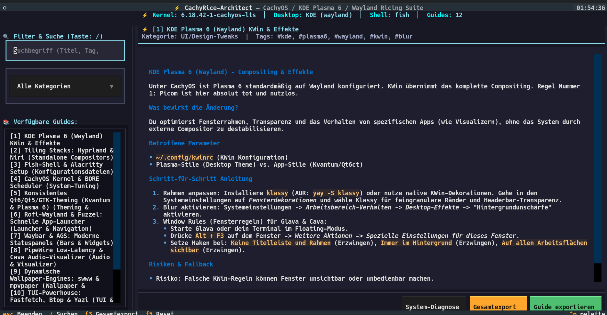

[🇩🇪 Zur deutschen Dokumentation wechseln](README_DE.md) | [🇬🇧 Switch to English Documentation](README.md)

# ⚡ CachyRice-Architect

[](https://github.com/Graba92/cachyos-rice-architect)
[](https://cachyos.org)
[](https://kde.org)
[](https://textual.textualize.io)
[](LICENSE)

<p align="center">
  
</p>

**CachyRice-Architect** is an interactive terminal knowledge base and ricing architecture toolkit for **CachyOS / Arch Linux**. It provides structured, battle-tested guidance for configuring **KDE Plasma 6 (Wayland)**, standalone tiling compositors (**Hyprland**, **Niri**), terminal workstations (**Fish**, **Starship**, **Alacritty**), and kernel/BORE scheduler performance tuning.

---

## ✨ Features (Version 2.0)

- 🎨 **Active 1-Click Theme & Dotfile Engine (NEW)**:
  Transform from a passive guide into an active deployment toolkit. Apply curated, battle-tested ricing configurations directly to your system with 1 click:
  - **Starship Prompts**: *Cyber-Neon* (high-contrast prompt with CachyOS glyphs & git status) and *Catppuccin Mocha* (modern pastel theme).
  - **Fastfetch Showcase**: *Clean-Cachy* layout displaying kernel, BORE scheduler, and hardware status bars.
  - **Terminal Emulators**: *Alacritty* and *Kitty* profiles with 88% opacity, KWin Wayland background blur, and Tokyo Night aesthetics.
- 🔄 **Automated Safety Backup & 1-Click Rollback (NEW)**:
  Zero risk to your existing dotfiles. Every applied preset automatically creates a timestamped snapshot in `~/.config/cachyos-rice-architect/backups/`. Revert instantly with `python main.py --rollback` or pressing `[F8]` in the TUI.
- 🖥️ **System & Ricing Auditor**: Autonomous diagnostic of your active desktop environment (Wayland compositor, GPU drivers, installed customization utilities, Nerd Fonts, shell).
- 📖 **Curated Architecture Handbooks**:
  1. **KDE Plasma 6 (Wayland) KWin & Effects**: Window decorations, Klassy border styling, background blur, and custom KWin window rules.
  2. **Standalone Tiling Stacks (Hyprland & Niri)**: Standalone Wayland configuration, Waybar integration, multi-monitor setups, and smooth animations.
  3. **Terminal Workflow (Fish & Alacritty)**: Modern Fish autosuggestions, Starship prompt integration, GPU-accelerated Alacritty rendering, and typography tuning.
  4. **System Tuning & BORE Scheduler**: CachyOS kernel optimizations (x86_64-v3/v4), sysctl tweaks, and interactive response latency reduction.
- 🚀 **Dual Interface**:
  - **Textual TUI**: Modern terminal user interface with interactive categories, search bar, scrollable viewer, and live Presets Modal (`[p]`).
  - **CLI Core**: Fast command-line interface for scripts (`--presets`, `--apply`, `--rollback`).
- 💾 **Batch Markdown Export**: Export all guides as cleanly formatted standalone markdown documents with a single command.

---

## 🏛️ Project Structure

```text
cachyos-rice-architect/
├── main.py                     # Central entry point (CLI & TUI)
├── run.sh                      # Universal starter script
├── setup.sh                    # Automated setup & dependency installer
├── requirements.txt            # Python dependencies
├── README.md                   # English documentation (this file)
├── README_DE.md                # German documentation
├── .gitignore                  # Git ignore rules
│
├── data/
│   └── guides.json             # Curated JSON knowledge base
│
└── modules/
    ├── __init__.py             # Module initializer
    ├── backup_manager.py       # Timestamped dotfile backup & rollback manager
    ├── theme_engine.py         # Starship, Fastfetch, Alacritty & Kitty presets
    ├── network.py              # Upstream wiki update check
    ├── storage.py              # JSON parser, search engine & exporter
    ├── system_info.py          # Hardware, desktop & tool auditing
    └── tui.py                  # Fullscreen Textual TUI with Presets Modal
```

---

## 🚀 Installation & Setup

### 1. Automated Setup (Recommended)

The provided `setup.sh` script automatically detects Arch Linux / CachyOS and installs required dependencies using `pacman` or sets up a dedicated virtual environment:

```bash
git clone https://github.com/Graba92/cachyos-rice-architect.git
cd cachyos-rice-architect
chmod +x setup.sh run.sh
./setup.sh
```

### 2. Manual Installation via Pacman (Arch Linux / CachyOS)

```bash
sudo pacman -S --needed python-rich python-textual
```

### 3. Manual Installation via pip / Virtual Environment

```bash
python3 -m venv .venv
source .venv/bin/activate
pip install -r requirements.txt
```

---

## 🖥️ Usage

### 1. Launch Interactive TUI
```bash
./run.sh
# or
python3 main.py
```

### 2. Standalone CLI Commands (Headless)

```bash
# Run system and ricing environment diagnostics:
python3 main.py --info

# List all available guides in a tabular view:
python3 main.py --list

# Read a specific guide directly in the terminal (e.g. guide ID 1):
python3 main.py --read 1

# Search guides by keyword or tag:
python3 main.py --search kwin

# Export all guides to standalone Markdown files:
python3 main.py --export ./exported_guides/

# Classic interactive console menu fallback:
python3 main.py --cli
```

---

## 📄 License

This project is licensed under the [MIT License](LICENSE).
